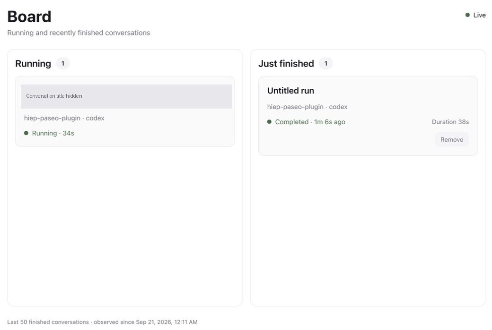
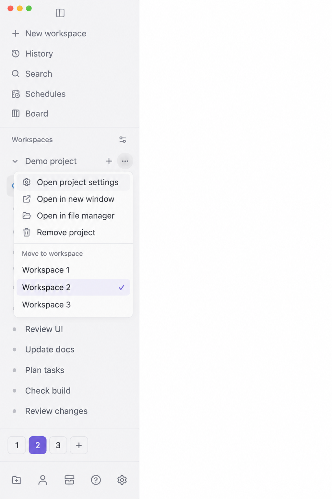
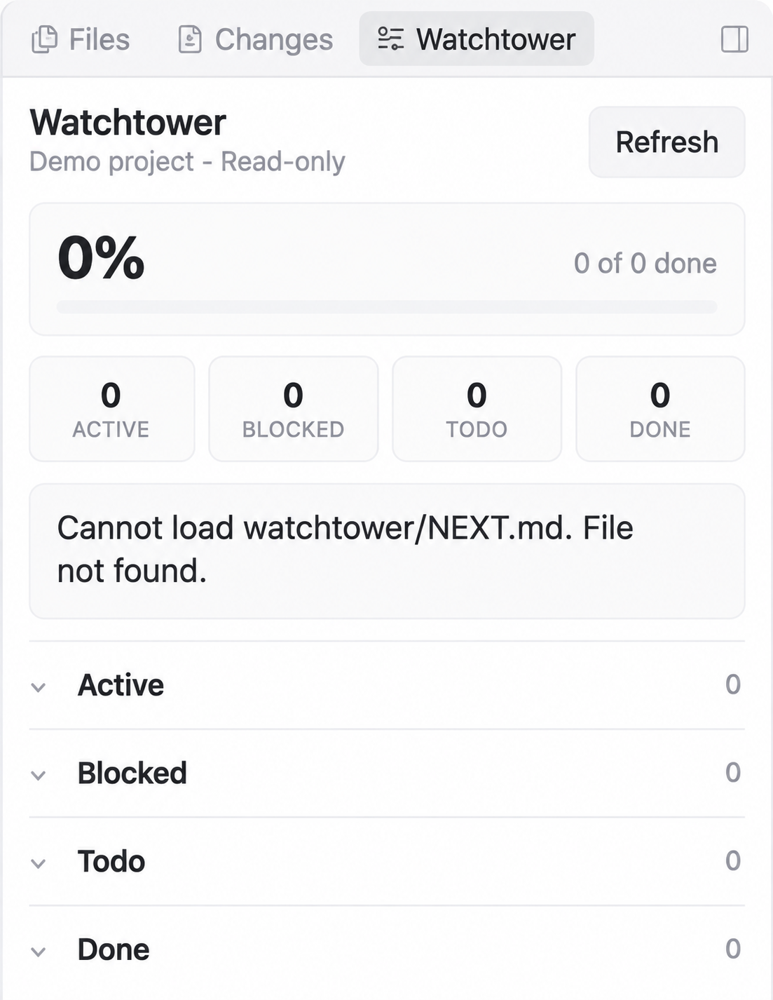
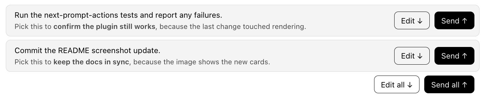
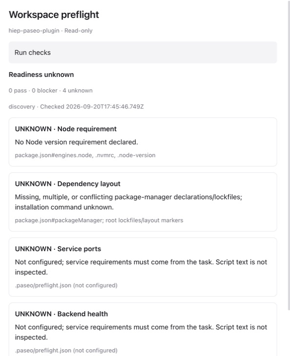
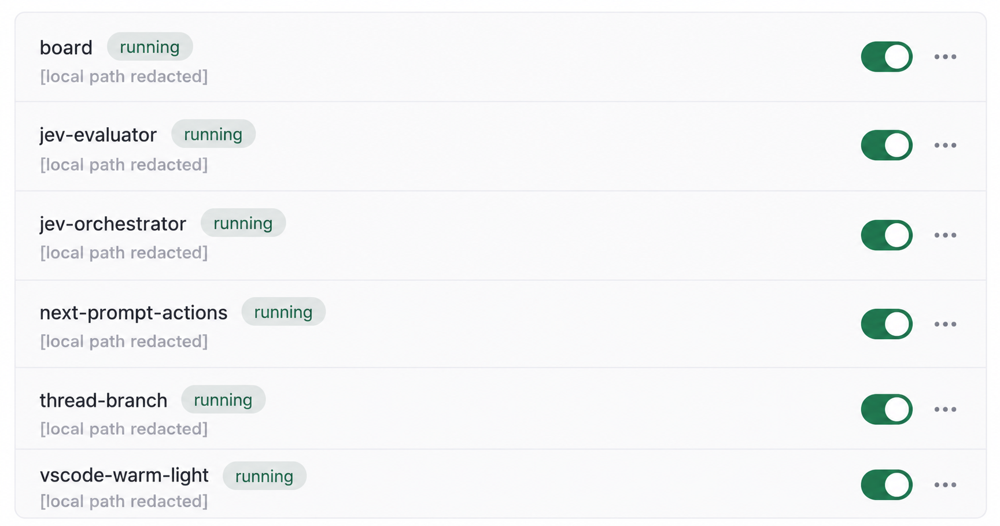

# Hiep Paseo plugins

See what your agents are doing. Keep projects organized. Bring task context and
workspace checks into Paseo without leaving your conversation.

Eight independent local plugins. Install only what you need; each owns its
dependencies, checks, and configuration.

## See every conversation at a glance

Board puts running and recently finished conversations side by side. Open a card
to jump back into its chat, or clear a finished card without deleting the conversation.



[Explore Board and install →](plugins/board/README.md)

## Give each project a place

Workspace Spaces adds numbered tabs to the desktop sidebar. Move a whole project
and its sessions from the existing project menu, then switch Spaces while your
current chat stays open.



[Set up Spaces →](plugins/workspace-spaces/README.md)

## Turn a plan into context

Watchtower board brings progress, blockers, and task briefs into Explorer. Expand
a task to read its brief, then use **composer + → Watchtower task** to attach a
snapshot to your next message. Nothing sends automatically.



[Open your Watchtower plan →](plugins/watchtower-board/README.md)

## Read the next step, then send it

Next prompt actions puts **Send** at the bottom right of a suggested prompt.
Read the full suggestion, then continue in the same conversation without copying
and pasting. Your composer draft stays intact.



Optional Jev auto-run lives in Command Center and starts off. Desktop only;
uses a private adapter for the existing Markdown blocks.

[Set up next prompt actions →](plugins/next-prompt-actions/README.md)

## Find missing prerequisites before starting work

Workspace preflight checks runtime requirements, dependency presence, configured
ports, and local health endpoints. Measurements stay separate from assumptions:
this repository-root capture shows unknown coverage, so missing configuration
never looks like a pass. Suggestions never execute automatically.



[Configure preflight checks →](plugins/workspace-preflight/README.md)

## Ask a focused second opinion

Jev gives Codex and Claude agents a typed evaluation tool: boolean, choice, and
score questions over state you choose to share. Pair it with preflight to evaluate
which evidence matters for the task. Your coding agent remains in control.



Jev works through MCP, not a standalone page. This capture shows installation
status, not an evaluation result. Evaluations require a configured Vercel AI
Gateway key and consume API quota.

[Try a typed Jev evaluation →](plugins/jev-evaluator/README.md)

Screenshots captured from Paseo desktop 0.8.0. Cropped for focus; conversation
titles and local installation paths redacted. See each plugin's documentation
for client support and limitations, including Spaces' private desktop adapter.

## Pick your plugins

| Plugin | Purpose |
| --- | --- |
| [vscode-warm-light](plugins/vscode-warm-light/README.md) | Apply the warm, customized VS Code Light+ palette through Paseo's theme API. |
| [next-prompt-actions](plugins/next-prompt-actions/README.md) | Send next-step prompts inside their blocks on desktop, with optional bounded Jev auto-run. |
| [jev-orchestrator](plugins/jev-orchestrator/README.md) | Direct Jev model/effort routing to one agent, plus optional scoped delegation with discovery, escalation, review, and ownership locks. |
| [Board](plugins/board/README.md) | Show one card per Paseo conversation with its latest running or finished state. |
| [jev-evaluator](plugins/jev-evaluator/README.md) | Expose Jev evaluations as an MCP tool for Codex and Claude agents. |
| [watchtower-board](plugins/watchtower-board/README.md) | Browse read-only Watchtower tasks and attach task briefs in the composer. |
| [workspace-preflight](plugins/workspace-preflight/README.md) | Discover workspace prerequisites, expose read-only MCP evidence, and optionally ask Jev for task relevance. |
| [workspace-spaces](plugins/workspace-spaces/README.md) | Group projects with numbered Spaces in the desktop sidebar; standalone fallback on other clients. |

## Install a plugin

```sh
cd plugins/jev-evaluator
npm ci
npm run typecheck
npm run lint
npm test
paseo plugin install "$PWD" --id jev-evaluator
```

After editing a plugin, run its checks and `paseo plugin reload <plugin-id>`.
See each plugin README for requirements and configuration.

## Add another plugin

Create `plugins/<plugin-id>/` with its own `paseo-plugin.json` and runtime entry.
Install and manage each plugin independently; no root workspace build is required.
