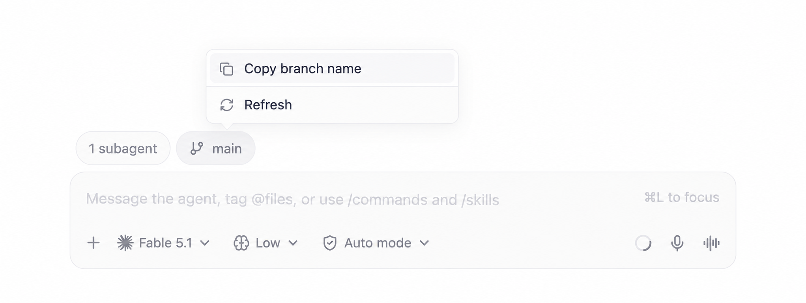
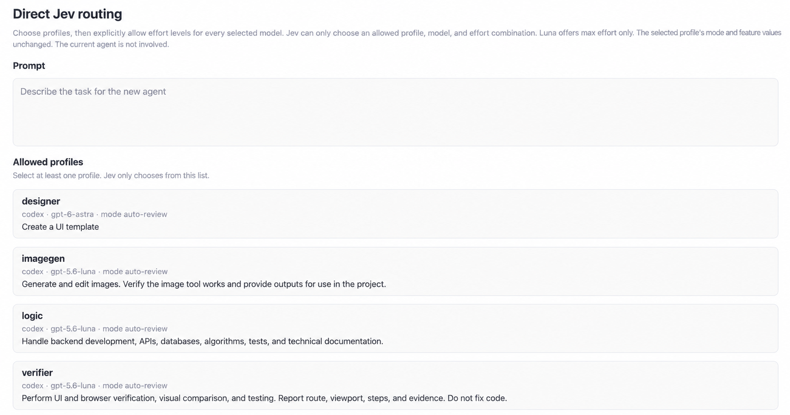
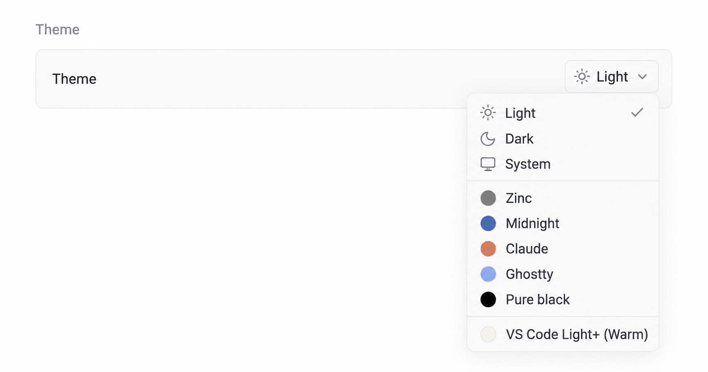

# Hiep Paseo plugins

See what your agents are doing. Keep projects organized. Bring task context and
workspace checks into Paseo without leaving your conversation.

Eleven independent local plugins. Install only what you need; each owns its
dependencies, checks, and configuration.

Gallery refreshed September 22, 2026 from Paseo desktop **0.9.0-beta.2**.
The eight refreshed images are AI-edited screenshot illustrations: Codex Image Gen
crops the UI and replaces private conversation titles, project names, profile notes,
and local paths with sample text. They are visual previews, not pixel-exact test evidence.
The Next prompt actions image is the earlier synthetic-text capture from desktop 0.8.0.

## See every conversation at a glance

Board puts running and recently finished conversations side by side, grouped into
distinct pastel project blocks with bot avatars. Star a conversation to keep its
cluster above project groups; scale the board from 10% to 200% with **UI size**.


Parent conversations keep their subagents in collapsible, compact card panels.
Open a card to return to its chat; child threads offer **Jump To Parent**.
Removing a finished cluster hides its cards without deleting the conversations.

[Explore Board and install →](plugins/board/README.md)

## Give each project a place

Workspace Spaces adds numbered tabs to the desktop sidebar. Move a whole project
and its sessions from the existing project menu, then switch Spaces while your
current chat stays open.
Swipe horizontally across the project list to switch adjacent Spaces. Removing
a Space moves its projects to a neighboring Space; the final Space stays protected.


[Set up Spaces →](plugins/workspace-spaces/README.md)

## Turn a plan into context

Watchtower board brings progress, blockers, and task briefs into Explorer. Expand
a task to read its brief, then use **composer + → Watchtower task** to attach a
snapshot to your next message. Nothing sends automatically.


This capture shows the missing-file state when the repository has no active
`watchtower/NEXT.md`.

[Open your Watchtower plan →](plugins/watchtower-board/README.md)

## Read the next step, then send it

Next prompt actions turns each suggested prompt into a card with **Edit** and
**Send**, plus an optional reason. Several prompts add **Edit all** and
**Send all**. Continue in the same conversation without copying and pasting.


Sample capture, September 23, desktop 0.9.1.

Optional Jev auto-run lives in Command Center and starts off. Desktop only;
uses a private adapter for the existing Markdown blocks.

[Set up next prompt actions →](plugins/next-prompt-actions/README.md)

## Keep your branch beside the composer

Thread branch shows the conversation's current Git branch beside its other pills.
Open the branch menu to copy its name or refresh. When a matching pull request
exists, a separate **#PR** pill opens it in one click.



The capture shows `main` without a PR pill. PR discovery requires authenticated
`gh`; the branch itself only requires Git.

[Set up Thread branch →](plugins/thread-branch/README.md)

## Choose the models a task can use

Jev orchestrator's **Direct Jev routing** panel lets you choose saved profiles
and allowed effort levels before **Route and run** creates one agent in the
current workspace. Profile permissions and features stay attached to that choice.



Open it from Command Center or `/route`. This capture shows profile selection;
no task was submitted. Jev routing consumes API quota.

[Explore Jev routing →](plugins/jev-orchestrator/README.md)

## Bring a warmer palette to Paseo

VS Code Light+ (Warm) adds a warm neutral theme through Paseo's theme API.
Choose it in **Settings → Appearance**; typography and layout remain Paseo's.



The picker confirms the theme is available; this capture keeps Light selected.

[Install the warm theme →](plugins/vscode-warm-light/README.md)

## Find missing prerequisites before starting work

Workspace preflight checks runtime requirements, dependency presence, configured
ports, and local health endpoints. Measurements stay separate from assumptions:
this repository-root capture shows unknown coverage, so missing configuration
never looks like a pass. Suggestions never execute automatically.


[Configure preflight checks →](plugins/workspace-preflight/README.md)

## Ask a focused second opinion

Jev gives Codex and Claude agents a typed evaluation tool: boolean, choice, and
score questions over state you choose to share. Pair it with preflight to evaluate
which evidence matters for the task. Your coding agent remains in control.


Jev works through MCP, not a standalone page. This capture shows installation
status, not an evaluation result. Evaluations require a configured Vercel AI
Gateway key and consume API quota.

[Try a typed Jev evaluation →](plugins/jev-evaluator/README.md)

## Keep threads tidy automatically

Thread janitor archives idle threads with no confirmation dialog. By default a thread
idle for more than 24 hours is archived; archiving stays reversible and never deletes
agents, files, or worktrees. Sweeps run after `agent.turn_ended`/`agent.created` hooks
and on a 30-minute timer, at most once per 10 minutes.

[Configure Thread janitor →](plugins/thread-janitor/README.md)

## Attach another thread's reply

Thread context attach brings a Paseo thread's last reply into your composer through
**+ → Thread**, replacing `/tmp` handoff files and copy-paste between Codex and Claude
threads. Nothing sends automatically; review the composer and press Send yourself.

[Set up Thread context attach →](plugins/thread-context-attach/README.md)

See each plugin's documentation for client support and limitations, including
Spaces' and Next prompt actions' private desktop adapters. Installed/running
status alone does not prove every plugin action works.

## Pick your plugins

| Plugin | Purpose |
| --- | --- |
| [vscode-warm-light](plugins/vscode-warm-light/README.md) | Apply the warm, customized VS Code Light+ palette through Paseo's theme API. |
| [next-prompt-actions](plugins/next-prompt-actions/README.md) | Send next-step prompts inside their blocks on desktop, with optional bounded Jev auto-run. |
| [prompt-translate](plugins/prompt-translate/README.md) | Show English translations under Vietnamese prompts, and enhance drafts into English prompts with Cmd/Ctrl+Enter, on desktop. |
| [thread-branch](plugins/thread-branch/README.md) | Show the current branch beside the composer and open its PR through a separate pill. |
| [jev-orchestrator](plugins/jev-orchestrator/README.md) | Direct Jev model/effort routing to one agent, plus optional scoped delegation with discovery, escalation, review, and ownership locks. |
| [Board](plugins/board/README.md) | Group conversations by project with pastel colors, avatars, parent/subagent clusters, stars, and UI scaling. |
| [jev-evaluator](plugins/jev-evaluator/README.md) | Expose Jev evaluations as an MCP tool for Codex and Claude agents. |
| [watchtower-board](plugins/watchtower-board/README.md) | Browse read-only Watchtower tasks and attach task briefs in the composer. |
| [workspace-preflight](plugins/workspace-preflight/README.md) | Discover workspace prerequisites, expose read-only MCP evidence, and optionally ask Jev for task relevance. |
| [workspace-spaces](plugins/workspace-spaces/README.md) | Group projects with numbered Spaces in the desktop sidebar; standalone fallback on other clients. |
| [thread-janitor](plugins/thread-janitor/README.md) | Archive idle threads automatically, with no confirmation dialog. |
| [thread-context-attach](plugins/thread-context-attach/README.md) | Attach the last reply of another Paseo thread to your next message. |
| [loop-verify](plugins/loop-verify/README.md) | Prototype: retry a labeled agent's goal in fresh child agents until a verify command passes, up to 5 rounds. |

## Install a plugin

```sh
cd plugins/jev-evaluator
npm ci
npm run typecheck
npm run lint
npm test
paseo plugin install "$PWD" --id jev-evaluator
```

After editing a plugin, run its checks and `paseo plugin reload <plugin-id>`.
See each plugin README for requirements and configuration.

## Add another plugin

Create `plugins/<plugin-id>/` with its own `paseo-plugin.json` and runtime entry.
Install and manage each plugin independently; no root workspace build is required.
